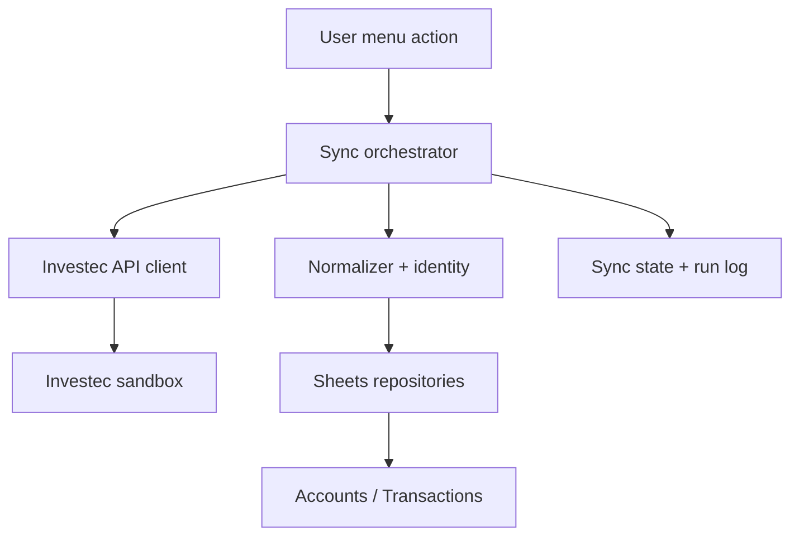

# Investec Budgeter — Phase 2 Implementation Plan

**Phase:** 2 · Investec Integration  
**Status:** Planning baseline  
**Primary runtime:** Google Apps Script, authored in TypeScript  
**Initial environment:** Investec sandbox only  
**Primary user:** A single owner of one Google Sheet  
**Security posture:** Read-only bank permissions, minimum scopes, no secrets in cells or logs

## 1. Executive decision

Phase 2 will build a reliable, auditable ingestion boundary between the Investec Private Bank API and a normalized Google Sheets transaction ledger.

The phase succeeds when the workbook can:

1. authenticate to the Investec sandbox without exposing credentials;
2. discover permitted accounts and retrieve balances;
3. fetch transactions over a configurable, overlapping date window;
4. normalize provider responses into a stable internal model;
5. insert new transactions and update previously imported transactions without duplication;
6. preserve user-owned spreadsheet fields during re-sync;
7. produce a useful sync run record without logging sensitive payloads; and
8. recover safely from partial failures and repeated manual runs.

Phase 2 does **not** decide what a transaction means. Categorisation, recurring-obligation matching, budget reconciliation, a Needs Review inbox, scheduled unattended sync, and Safe to Spend are deferred to Phases 3 and 4.

## 2. Evidence and current-state observations

The project roadmap defines Phase 2 as “Authenticate safely, fetch accounts/balances/transactions, import them into a transaction ledger and make sync idempotent.” The existing Phase 2 backlog has five items:

- create the Apps Script project structure;
- implement Investec authentication;
- import accounts and balances;
- import transaction history; and
- implement idempotent transaction sync.

The current `Spending Tracker 2026` workbook uses one sheet per month. Income, Fundamentals, Fun, and Future You are laid out in adjacent column groups, with manually maintained Paid/Pending status values. This is a useful human budget view, but it is not a safe bank-import target: it has no append-only ledger, provider transaction key, source-account key, raw/audit fields, sync metadata, or distinction between bank-owned and user-owned data.

Phase 2 therefore introduces a canonical `Transactions` ledger and supporting technical sheets. It does not overwrite the current monthly tabs. Phase 3 may later project or reconcile ledger rows into monthly budget views.

## 3. Scope boundary

### 3.1 In scope

- Local TypeScript project compiled for Apps Script.
- Manual menu actions for setup, connection test, account refresh, balance refresh, and transaction sync.
- Sandbox/prod environment configuration, with production disabled by default.
- Investec OAuth token acquisition and in-memory/cache reuse.
- Account discovery and selection.
- Balance retrieval.
- Transaction retrieval with an overlap window.
- Provider DTO validation and normalization.
- Deterministic identity and idempotent upsert.
- Technical sheets: `Settings`, `Accounts`, `Transactions`, `Sync Runs`, and optionally hidden `System`.
- Concurrency protection and resumable sync checkpoints.
- Structured, redacted operational logging.
- Unit, contract-fixture, repository, and sandbox smoke tests.
- Setup, recovery, credential-rotation, and release documentation.

### 3.2 Explicitly out of scope

- Payments, transfers, beneficiary access, or any write capability at Investec.
- Automatic transaction categorisation.
- Merchant normalization beyond lossless/basic text cleanup.
- Recurring obligation matching or Paid/Pending updates.
- Budget-envelope calculations.
- Safe to Spend.
- Notion transaction storage.
- Multi-user authorization or public distribution.
- Marketplace add-on packaging.
- A standalone .NET backend.
- Fully unattended scheduled sync. The code must be trigger-safe, but trigger installation belongs to Phase 4.

### 3.3 Why this boundary

Bank ingestion and financial interpretation fail differently. Ingestion needs fidelity, replay, deduplication, and auditability. Reconciliation needs business rules and user feedback. Combining them makes it difficult to determine whether a wrong budget result came from the provider response, normalization, row identity, or a matching rule.

**Drawback:** Phase 2 will visibly import data without yet delivering the complete “budget ticks itself off” experience. That is acceptable because the ledger is the foundation of every later automation.

## 4. Architecture decision

### 4.1 Recommended Phase 2 architecture



Use a **container-bound Apps Script deployment**, authored as modular TypeScript in a normal local repository, bundled into Apps Script-compatible JavaScript and deployed with `clasp`.

### 4.2 Why Apps Script now

- It is colocated with the workbook and can expose a simple custom menu.
- It minimizes infrastructure and hosting cost during personal validation.
- Script Properties, Cache Service, Lock Service, and time-driven triggers cover the MVP's operational needs.
- It keeps the first integration easy to inspect and run.

### 4.3 Apps Script drawbacks

- Execution duration, URL-fetch quotas, property limits, and trigger behavior impose hard ceilings.
- There is no durable transactional database; a multi-step sheet write can fail partway through.
- Secret storage is better than spreadsheet cells but not equivalent to a dedicated secret manager.
- Bundling, debugging, stack traces, and observability are less pleasant than in .NET.
- A container-bound script couples code ownership and spreadsheet ownership.
- User Properties behave differently under multiple users; this architecture is intentionally single-user.
- Large ledgers make whole-sheet reads and writes increasingly expensive.

These drawbacks are tolerable for the single-user proof. The code must isolate the provider adapter, domain model, and repositories so they can later move behind a .NET service without changing the workbook contract.

### 4.4 Alternatives rejected for Phase 2

| Alternative | Advantage | Drawback | Decision |
|---|---|---|---|
| .NET API + database immediately | Strong secrets, jobs, tests, observability, migrations | Hosting, OAuth callback/config complexity, more moving parts before validating the workflow | Defer to Phase 5 or earlier only if sandbox constraints force it |
| Apps Script written directly in one `.gs` file | Fastest first call | Poor module boundaries, weak testing, painful migration | Reject |
| Google Sheets formulas calling the API | Visible to the user | Formulas are not suitable for secure credentials, paging, retries, or idempotent writes | Reject |
| Notion as transaction store | Attractive review UI | Weak fit for high-volume financial ledger and provider-key upserts | Reject |
| Google Cloud Functions/Run | Better runtime and secrets than Apps Script | Cloud setup and recurring cost; still needs Sheets orchestration | Defer |

## 5. Repository and build design

### 5.1 Proposed structure

```text
investec-budgeter/
├── appsscript.json
├── package.json
├── tsconfig.json
├── vitest.config.ts
├── eslint.config.js
├── .clasp.json.example
├── .env.example
├── src/
│   ├── entrypoints/
│   │   ├── onOpen.ts
│   │   └── menuActions.ts
│   ├── application/
│   │   ├── syncAccounts.ts
│   │   ├── syncBalances.ts
│   │   ├── syncTransactions.ts
│   │   └── testConnection.ts
│   ├── domain/
│   │   ├── account.ts
│   │   ├── transaction.ts
│   │   ├── syncRun.ts
│   │   └── errors.ts
│   ├── investec/
│   │   ├── authClient.ts
│   │   ├── apiClient.ts
│   │   ├── dto.ts
│   │   ├── validators.ts
│   │   └── normalizers.ts
│   ├── sheets/
│   │   ├── settingsRepository.ts
│   │   ├── accountRepository.ts
│   │   ├── transactionRepository.ts
│   │   ├── syncStateRepository.ts
│   │   ├── syncRunRepository.ts
│   │   └── schemaManager.ts
│   ├── platform/
│   │   ├── config.ts
│   │   ├── secrets.ts
│   │   ├── http.ts
│   │   ├── clock.ts
│   │   ├── locks.ts
│   │   ├── cache.ts
│   │   └── logger.ts
│   └── shared/
│       ├── hash.ts
│       ├── dates.ts
│       └── result.ts
├── tests/
│   ├── unit/
│   ├── fixtures/
│   ├── contract/
│   └── integration/
├── scripts/
│   ├── build.mjs
│   └── validate-bundle.mjs
└── docs/
    ├── setup.md
    ├── operations.md
    ├── data-dictionary.md
    └── decisions/
```

### 5.2 Build choices

- **TypeScript:** strict mode enabled; no implicit `any`; DTOs remain distinct from domain types.
- **Bundler:** `esbuild` emitting one Apps Script-compatible bundle, with global wrapper functions for menu entry points.
- **Tests:** Vitest for fast TypeScript unit tests.
- **Deployment:** `clasp push` to a sandbox script project. Production script ID must never be committed.
- **Formatting/linting:** Prettier plus ESLint, run in CI.

### 5.3 Trade-offs

**Bundling vs copying source files:** Bundling simplifies dependency order and allows normal modules. The drawback is less readable deployed code and source-map limitations in Apps Script errors.

**Vitest vs Apps Script-native tests:** Vitest is fast and mock-friendly, but it does not reproduce Google runtime behavior. A small sandbox smoke suite is still required.

**`clasp` vs editor-only deployment:** `clasp` gives version control and repeatability. It introduces a local credential/tooling step and the risk of pushing to the wrong script. Separate `.clasp.json` files or explicit deployment scripts must make the target visible.

## 6. Workbook technical model

### 6.1 Sheet ownership rule

Each column must be classified as one of:

- **provider-owned:** may be inserted or updated by sync;
- **system-owned:** calculated by integration code;
- **user-owned:** never overwritten by Phase 2 sync.

This rule prevents a later sync from destroying manual categories, notes, exclusions, or reconciliation decisions.

### 6.2 `Settings` sheet

Human-editable, non-secret configuration:

| Key | Example | Validation | Notes |
|---|---|---|---|
| Environment | `sandbox` | enum | `production` blocked until explicitly enabled in code/config |
| Selected Account ID | opaque ID | value from `Accounts` | Never use account number as the key |
| Initial Import Start Date | `2026-01-01` | ISO date | Used only when no checkpoint exists |
| Overlap Days | `14` | integer 1–90 | Default 14; protects against late posting changes |
| Page Size | provider-supported value | bounded integer | Verify against live API contract |
| Max Pages Per Run | `20` | integer | Prevents runaway execution |
| Workbook Time Zone | `Africa/Johannesburg` | fixed/display only | Must agree with spreadsheet setting |

Do not place client ID, client secret, access tokens, full raw responses, or account numbers here.

**Drawback:** Settings cells are easy to edit accidentally. Use protected ranges, data validation, a schema/version marker, and clear descriptions. Protection is a guardrail, not a security boundary for the owner.

### 6.3 `Accounts` sheet

Recommended columns:

| Column | Ownership | Purpose |
|---|---|---|
| Account Key | system | Stable hash of environment + provider account ID |
| Provider Account ID | provider | Opaque ID used for API calls |
| Account Name | provider | Display label |
| Account Type | provider | Provider type/code |
| Account Number Masked | system | Last four only where available |
| Currency | provider | Expected `ZAR`, but never hard-code |
| Current Balance | provider | Exact decimal rendered as currency |
| Available Balance | provider | Keep separate from current balance |
| Balance As Of UTC | system | Retrieval timestamp unless provider supplies one |
| Is Selected | user | Account included in sync |
| Is Active | system | False if no longer returned; do not delete history |
| First Seen UTC | system | Audit |
| Last Seen UTC | system | Audit |

### 6.4 `Transactions` sheet

Recommended canonical order:

| Column | Ownership | Required | Meaning |
|---|---|---:|---|
| Row Key | system | Yes | Immutable internal key used for upsert |
| Environment | system | Yes | Sandbox and production data must never collide |
| Account Key | system | Yes | Internal account reference |
| Provider Account ID | provider | Yes | Opaque provider reference |
| Provider Transaction ID | provider | No | Use when present and proven stable |
| Transaction Type | provider | No | Provider type/code |
| Status | provider | No | Pending/posted where exposed |
| Transaction Date | provider | Yes | Economic/event date |
| Posting Date | provider | No | Bank posting date; not interchangeable with transaction date |
| Value Date | provider | No | Preserve if returned |
| Description Raw | provider | Yes | Exact provider description |
| Reference Raw | provider | No | Exact provider reference |
| Amount | provider | Yes | Signed decimal; direction contract documented |
| Currency | provider | Yes | Never assume ZAR in the model |
| Running Balance | provider | No | Preserve if exposed; do not derive identity from it |
| Posted Order | provider | No | Preserve even when zero; do not use alone as identity |
| Provider Payload Hash | system | Yes | Detect provider-owned field changes |
| Identity Version | system | Yes | e.g. `v1` |
| First Imported UTC | system | Yes | Immutable |
| Last Seen UTC | system | Yes | Updated on every overlapping successful fetch |
| Last Changed UTC | system | Yes | Updated only when provider hash changes |
| Sync Run ID | system | Yes | Last run that inserted/updated/saw row |
| Category | user | No | Reserved for Phase 3; never overwritten |
| Budget Item ID | user | No | Reserved for Phase 3 |
| Review Status | user | No | Reserved for Phase 3 |
| User Note | user | No | Never overwritten |
| Excluded | user | No | Never overwritten |

Do not store OAuth tokens or full authorization headers. Avoid storing full raw JSON in the workbook; it increases exposure and makes the sheet unwieldy. Preserve specifically enumerated source fields and a payload hash. During development, sanitized fixtures belong in the repository.

**Raw JSON drawback:** not storing it weakens forensic debugging when Investec adds fields. Mitigation: validate unknown fields, record schema-drift warnings, retain sanitized failing fixtures, and add explicit columns when a field becomes relevant.

### 6.5 `Sync Runs` sheet

Append one row per run:

- Run ID (UUID)
- Started UTC
- Finished UTC
- Environment
- Requested action
- Account count
- Window start/end
- Pages requested
- Records received
- Inserted
- Updated
- Unchanged
- Rejected
- Status (`RUNNING`, `SUCCEEDED`, `PARTIAL`, `FAILED`, `SKIPPED_LOCKED`)
- Last completed stage
- Redacted error code
- Redacted error message
- Correlation/request IDs if safe and supplied

This is an operational audit, not a transaction log. Never log credentials, authorization headers, full request/response bodies, or unmasked account numbers.

### 6.6 Hidden `System` sheet vs Properties

Use Script Properties for secrets and technical identifiers. Use Document Properties for workbook-specific checkpoints if available and appropriate. A hidden `System` sheet may mirror non-secret schema version and last successful run for transparency.

**Properties advantage:** not accidentally edited through normal sheet use.  
**Properties drawback:** poor visibility and limited storage; manual recovery is harder.  
**Hidden-sheet advantage:** inspectable and easy to back up.  
**Hidden-sheet drawback:** not secret; users can unhide/change it.

Decision: secrets only in Script/User Properties; non-secret checkpoints in Document Properties; user-visible sync status in `Sync Runs`/`Settings`.

## 7. Secrets and configuration

### 7.1 Secret inventory

- Investec client ID
- Investec client secret
- optional API key or subscription key if required by the current contract
- access token (ephemeral)
- token expiry instant

### 7.2 Storage decision

For the single-owner Phase 2 sandbox, store long-lived credentials in **User Properties** if the connection is personal to the executing Google identity; otherwise use Script Properties only for a single-owner bound script. Cache access tokens in Cache Service and treat expiry as authoritative.

Never place secrets in:

- spreadsheet cells or notes;
- source control;
- `.clasp.json` examples;
- CI logs;
- Apps Script logs;
- error messages shown in the workbook.

### 7.3 Drawbacks and migration trigger

Apps Script Properties are pragmatic, not a first-class vault. Script editors may have powerful access, rotation is manual, and audit capabilities are limited. Move authentication behind a backend plus managed secret store before multi-user productisation, third-party customer access, or any payment capability.

### 7.4 Credential setup flow

1. User selects `Investec Budgeter → Configure credentials`.
2. HTML modal accepts credential fields using password inputs.
3. Server-side handler validates non-empty values and writes properties.
4. Handler returns only success/failure, never values.
5. UI immediately clears the form.
6. `Test connection` requests a token and a harmless read endpoint.
7. Logs contain only a classified result.

**Drawback:** an HTML modal adds code and can create false confidence about security. It prevents shoulder-surfacing in cells but cannot protect against a malicious script editor.

## 8. Authentication client

### 8.1 Required behavior

The auth client must:

- read secrets through an injected secret store;
- build the token request exactly to the current Investec authorization contract;
- set explicit timeouts where supported;
- parse success and OAuth error responses separately;
- compute an expiry instant with a safety skew (for example 60 seconds);
- cache only the access token and expiry;
- refresh/reacquire once after an authenticated request returns 401;
- never retry invalid-client or invalid-scope failures indefinitely;
- redact all sensitive headers and bodies.

### 8.2 Token algorithm

1. Read cached token.
2. If token expiry is more than the safety skew in the future, return it.
3. Acquire a script/user lock dedicated to token refresh.
4. Re-read cache after acquiring the lock; another execution may have refreshed it.
5. If still absent/expired, request a new token.
6. Validate `access_token`, token type, and expiry fields.
7. Cache with a TTL no longer than provider expiry minus skew.
8. Release lock in `finally`.

### 8.3 Decision drawbacks

**Cache Service:** reduces token calls, but cache eviction is allowed and must not be treated as durable. A cache miss simply reacquires a token.

**One retry on 401:** handles expired/revoked cached tokens. More retries can hide credential problems or create a loop.

**Safety skew:** reduces near-expiry failures but slightly increases token calls.

### 8.4 Acceptance tests

- Valid sandbox credentials return a usable token.
- Wrong client secret produces a classified configuration/auth error.
- Token values never appear in logs or sheet cells.
- Two simultaneous calls result in at most one token acquisition after locking.
- Cached token is reused while safely valid.
- A 401 invalidates cache and causes exactly one re-authentication attempt.

## 9. HTTP and Investec API client

### 9.1 Layering

`HttpTransport` owns URL fetch, headers, status, timeout behavior, and response bytes. `InvestecApiClient` owns endpoint paths and provider DTOs. Application use cases call the API client, never `UrlFetchApp` directly.

This separation permits deterministic tests and later replacement with a .NET `HttpClient` adapter.

### 9.2 Request rules

- Base URLs are selected by a closed environment enum, never free text.
- Endpoint paths are constants verified against the current API specification.
- Query dates use provider-required format and a single date utility.
- Authorization headers are added in one interceptor/wrapper.
- Accept/content headers are explicit.
- Provider request/correlation identifiers are retained when safe.
- Non-2xx responses are not parsed as successful DTOs.
- Redirects are not blindly followed to unknown hosts.

### 9.3 Retry policy

| Failure | Retry? | Policy |
|---|---:|---|
| Network/transient fetch exception | Yes | bounded exponential backoff + jitter |
| HTTP 408 | Yes | bounded |
| HTTP 429 | Yes | honor `Retry-After` when present; otherwise backoff |
| HTTP 500/502/503/504 | Yes | bounded |
| HTTP 401 | Once | clear token, re-authenticate, replay once |
| HTTP 403 | No | permission/scope error |
| HTTP 400/404/422 | No | request/contract/configuration error |
| JSON parse/schema failure | No | contract error; retain sanitized diagnostic |

Suggested maximum: three transport attempts per page, subject to remaining execution budget.

**Drawback:** retries can consume Apps Script execution time and repeat expensive provider requests. Every retry decision must check remaining time and cannot perform duplicate sheet writes because writes occur only after a page/window has been normalized.

### 9.4 Contract uncertainty policy

The public documentation UI is dynamically rendered. Exact endpoint paths, required headers, pagination shape, DTO fields, and rate limits must be copied from the live Investec developer specification into an ADR/contract fixture during implementation. Do not guess them from blog posts or older community code.

## 10. Provider DTO validation and normalization

### 10.1 Why validate at runtime

TypeScript types disappear at runtime. A provider can return an error envelope with HTTP 200, omit a field, change a nullability rule, or add a new transaction subtype. Runtime validation prevents malformed values from silently becoming financial records.

Use small explicit validators or a lightweight schema library compatible with the Apps Script bundle. Validate only fields needed for the canonical model, while detecting unknown/changed structure for diagnostics.

**Library drawback:** schema libraries increase bundle size. Hand-written validators are smaller but easier to make inconsistent. Pick one approach and test every DTO fixture.

### 10.2 Normalization rules

- Preserve raw description/reference strings exactly in raw columns.
- Trim only for derived identity components, never mutate the displayed source value.
- Parse dates according to the provider contract, not JavaScript locale heuristics.
- Convert instants to ISO UTC strings internally.
- Store transaction/posting/value dates as date-only values when the provider supplies dates without time.
- Represent money as a decimal string or integer minor units during processing; do not use floating-point arithmetic for identity or comparisons.
- Write numeric values to Sheets only after safe decimal parsing.
- Preserve sign exactly; document whether debits are negative and test it.
- Treat missing, empty, and null distinctly until the canonical rule is applied.
- Do not derive category from transaction type or description in this phase.

### 10.3 Date/time decision

Use UTC for system timestamps and `Africa/Johannesburg` for workbook display. Preserve bank-supplied date-only values without timezone shifting.

**Drawback:** carrying both date-only and timestamp semantics is more work. Treating all values as JavaScript `Date` risks moving a date backward/forward when rendered in a different timezone.

## 11. Transaction identity and idempotency

This is the most important technical decision in Phase 2.

### 11.1 Identity hierarchy

Use a versioned strategy:

1. **Preferred:** if Investec supplies a documented, stable transaction identifier that survives re-fetches and posting updates, compute `Row Key = hash(environment | accountId | providerTransactionId)`.
2. **Fallback:** if no stable ID exists, compute a deterministic fingerprint from the smallest set of stable provider fields confirmed by sandbox replay. Candidate components may include account ID, transaction date, posting date, amount in minor units, transaction type, provider reference, and description.
3. **Collision ordinal:** only if sandbox evidence proves identical legitimate transactions can share the complete fingerprint, add a deterministic occurrence discriminator based on provider ordering/fields. Never use spreadsheet row number or import time.

Identity is `v1` and stored per row so a future algorithm can coexist or migrate safely.

### 11.2 Why “last sync timestamp” is insufficient

- Transactions may post late.
- A pending item may become posted.
- Descriptions or references may be enriched after initial appearance.
- Provider dates may not reflect when an item became visible.
- A failed run may advance time without persisting all rows.

Therefore each sync re-fetches an overlapping window and upserts every record.

### 11.3 Why a naive composite key is dangerous

Two legitimate purchases can have the same date, merchant description, and amount. A composite key can collapse them into one row. Conversely, adding mutable posting fields can turn one transaction into two rows when it settles.

Before finalizing fallback identity, collect sandbox fixtures covering:

- two identical same-day transactions;
- pending-to-posted transition if exposed;
- reversal/refund;
- card purchase with enriched description;
- transfer between owned accounts;
- fee/interest transaction;
- zero `postedOrder` behavior;
- same reference reused across months.

### 11.4 Provider payload hash

Canonicalize the selected provider-owned fields in a fixed property order and hash that string. If row key matches and hash differs, update only provider/system-owned columns and set `Last Changed UTC`.

Do not hash user-owned fields. Do not hash volatile retrieval timestamps. Document canonical null, date, decimal, and whitespace encoding.

### 11.5 Upsert algorithm

1. Acquire the sync lock.
2. Validate the sheet schema and configuration.
3. Create a `RUNNING` sync-run row.
4. Read the existing transaction index using only key/hash/row-number columns.
5. Fetch and validate provider pages for the window.
6. Normalize all fetched items.
7. Detect duplicate row keys within the fetched batch; fail closed if conflicting payloads exist.
8. Partition into `insert`, `update`, and `unchanged`.
9. Apply updates in contiguous batches where practical.
10. Append inserts in one or a small number of range writes.
11. Never replace the entire `Transactions` sheet.
12. Update `Last Seen UTC` for fetched rows; this may be batched separately.
13. Persist the checkpoint only after all intended writes succeed.
14. Finalize the sync-run row.
15. Release lock in `finally`.

### 11.6 Drawback of updating `Last Seen UTC`

It creates many writes even when business data is unchanged. Alternatives are:

- update it only when a row changes, reducing writes but weakening evidence that it was present in the overlap;
- store presence at run level, reducing row writes but complicating forensic analysis.

Recommendation: for the MVP, update `Last Seen UTC` only for inserted/changed rows and record the successful window/run globally. Add per-row presence updates only if missing/deleted-provider detection becomes a requirement.

## 12. Sync window and checkpointing

### 12.1 Window calculation

- **First run:** `start = Initial Import Start Date`; `end = today in Johannesburg` or provider-supported latest bound.
- **Subsequent run:** `start = lastSuccessfulWindowEnd - overlapDays`; `end = today`.
- Clamp start to provider retention limits if any.
- Use inclusive/exclusive semantics exactly as the provider contract defines.

Default overlap: 14 days, configurable after observing Investec posting behavior.

**Drawback:** larger overlap improves correction capture but costs more calls and sheet comparisons. A too-small overlap can miss late mutations.

### 12.2 Checkpoint model

Store:

- last fully successful window end;
- last continuation token/page if resumability is supported;
- last successful run ID;
- schema version;
- identity version.

Never advance the success checkpoint on a partial/failed run.

### 12.3 Partial writes

Sheets does not provide a transaction spanning API calls. The design relies on idempotent replay:

- inserts written before a crash are found by row key next run;
- updates are deterministic and can be applied again;
- checkpoint remains unchanged, causing the overlap/window to replay;
- sync run remains `FAILED` or `PARTIAL` with its last stage.

**Drawback:** the ledger can be temporarily partially updated until the next successful run. A staging sheet would permit more atomic replacement, but doubles storage and still cannot guarantee a truly atomic swap. For the personal MVP, deterministic replay is simpler and safer.

## 13. Pagination and execution-budget control

### 13.1 Pagination

Implement the provider's actual page/cursor model behind an async-like iterator abstraction (synchronous in Apps Script runtime). The orchestrator should not know whether the API uses page numbers, offsets, cursors, or continuation tokens.

Stop and fail if:

- a cursor repeats;
- page count exceeds configured maximum;
- a page violates schema;
- the API claims more data but omits a continuation mechanism.

### 13.2 Runtime budget

At run start, capture the monotonic/wall clock. Before fetching another page or starting a write batch, compare elapsed time to a conservative soft deadline. If near the deadline:

- finish the current validated write unit;
- persist a non-secret continuation checkpoint only if its semantics are safe;
- mark run `PARTIAL`;
- do not advance the fully successful window checkpoint.

**Drawback:** resuming mid-window makes state more complex. For normal personal volumes, prefer completing one account/window in a run. Implement continuation only once real sandbox volumes approach execution limits.

## 14. Account and balance synchronization

### 14.1 Account flow

1. Fetch permitted accounts.
2. Validate DTOs.
3. Upsert by provider account ID/environment.
4. Mask account numbers before writing.
5. Preserve `Is Selected` user choice.
6. Mark missing previously seen accounts inactive; never delete them automatically.
7. Require explicit selection before transaction sync if multiple accounts exist.

### 14.2 Balance flow

1. For each selected active account, fetch balance using the documented endpoint.
2. Keep current and available balance separate.
3. Record retrieval timestamp and currency.
4. Update the `Accounts` sheet.
5. Do not backfill historical balances unless the provider explicitly supplies statements/history.

### 14.3 Drawbacks

- Masking loses some debugging convenience; provider account ID remains the API key.
- Current balance may not reconcile exactly to imported history if the history window is partial or pending items differ.
- Balance calls per account consume quota. A bulk endpoint should be used if officially supported.

## 15. Concurrency and locking

Use `LockService` around any sync that can write accounts, transactions, state, or runs.

Rules:

- `tryLock` with a short wait; do not make the user stare at a long hanging menu action.
- If unavailable, append or display `SKIPPED_LOCKED` without running.
- Use a separate short-lived auth-refresh lock if useful.
- Always release in `finally`.
- Never hold a lock while displaying UI prompts.

**Drawback:** a whole-sync lock serializes accounts and can waste time during HTTP waits. Fine-grained locks increase the chance of interleaved checkpoints and conflicting writes. Whole-sync locking is the correct simplicity trade-off for one owner.

## 16. Error model and user experience

### 16.1 Error classes

- `ConfigurationError`
- `AuthenticationError`
- `PermissionError`
- `RateLimitError`
- `TransientProviderError`
- `ProviderContractError`
- `DataValidationError`
- `SheetSchemaError`
- `ConcurrencyError`
- `ExecutionBudgetError`

Each error has a safe code, retryability, stage, and redacted user message. The original exception may be logged only after redaction.

### 16.2 Menu design

`Investec Budgeter` menu:

- Setup / repair technical sheets
- Configure credentials
- Test sandbox connection
- Refresh accounts
- Select account(s)
- Refresh balances
- Sync transactions
- View last sync
- Clear cached access token

Destructive/reset actions must be absent or require explicit confirmation. There should be no “clear transactions and resync” shortcut in the MVP.

### 16.3 User-facing result

After sync, show a compact result: window, received, inserted, updated, unchanged, rejected, and run ID. Do not display raw payloads or credentials.

## 17. Sheet schema management

### 17.1 Schema versioning

Store a numeric schema version. `setupOrMigrate()` performs explicit forward-only migrations:

- create missing technical sheets;
- verify exact headers;
- add new columns without reordering user data unnecessarily;
- apply number/date formats and protections;
- never silently delete unknown columns;
- stop on duplicate required headers or incompatible manual changes.

### 17.2 Header lookup

Repositories resolve columns by stable header name and validate uniqueness. They do not hard-code `A`, `B`, `C` throughout business logic.

**Drawback:** name lookup is slower and renaming a header is a breaking change. It is much safer than fixed positions in a user-editable workbook. Protect technical headers and use a centralized schema definition.

### 17.3 Formula safety

Provider strings beginning with `=`, `+`, `-`, or `@` can be interpreted as formulas by spreadsheets. All untrusted text must be written as literal values using APIs/options that prevent formula execution, or prefixed/escaped according to a tested Sheets strategy while preserving a raw-safe representation.

This protects against formula injection from transaction descriptions or references.

**Drawback:** prefixing with an apostrophe can alter visible/canonical text. Prefer cell writes that explicitly set string values and verify behavior with hostile fixtures.

## 18. Performance design

- Never call `getValue`/`setValue` in a loop.
- Read bounded ranges into arrays.
- Build an in-memory `Map<RowKey, ExistingRowMeta>`.
- Batch inserts and updates.
- Avoid reading user columns when only keys/hashes are needed.
- Do not sort the ledger automatically after each sync; sorting can invalidate cached row numbers and costs time.
- Use filters/views for display; retain stable append behavior.
- Consider archiving by year only after measured performance warrants it.

**Trade-off:** storing everything in one ledger simplifies lookup and reporting but will eventually slow. Premature year/month partitioning complicates idempotency and cross-period queries. Start with one ledger and define a measured migration threshold.

## 19. Testing strategy

### 19.1 Unit tests

Test pure logic exhaustively:

- date parsing and Johannesburg/UTC boundaries;
- decimal/minor-unit conversion;
- description/reference canonicalization;
- stable ID and fallback fingerprint;
- payload hash canonical order;
- ownership-aware merge;
- window calculation;
- retry classification;
- redaction;
- pagination stop conditions.

### 19.2 Fixture contract tests

Commit sanitized JSON fixtures for:

- token success/error;
- account list;
- current/available balances;
- transaction page(s);
- empty history;
- null/optional fields;
- unknown fields;
- pending/posted mutation if supported;
- duplicate-looking purchases;
- reversal/refund;
- malformed/error envelopes.

Every fixture must be scrubbed of real credentials, full account numbers, personally identifying descriptions, and tokens.

### 19.3 Repository tests

Using an in-memory sheet adapter, verify:

- schema creation and migration;
- header resolution;
- bulk append;
- provider-only update;
- preservation of user columns;
- duplicate-key detection;
- no formula injection;
- checkpoint update ordering.

### 19.4 Idempotency tests

Mandatory scenarios:

1. Empty ledger + batch → all inserted.
2. Same batch again → zero inserted, zero provider changes.
3. Same stable transaction with enriched provider field → one update, no insert.
4. Two legitimate identical-looking transactions → two rows.
5. Crash after inserts but before checkpoint → replay produces no duplicates.
6. User categorizes a row, provider updates description → category is preserved.
7. Sandbox and production return same ID → separate row keys.

### 19.5 Sandbox smoke tests

- Obtain token.
- Fetch account list.
- Fetch balance.
- Fetch a narrow transaction window.
- Run same window twice and inspect counts.
- Deliberately invalidate token and verify one refresh/retry.
- Deliberately remove permission and verify a safe non-retryable failure.

### 19.6 Tests Phase 2 cannot honestly guarantee

Sandbox data may not reproduce every production posting behavior. Identity and overlap assumptions must remain recorded as provisional until validated with a small, read-only production pilot.

## 20. Observability and privacy

### 20.1 Safe structured event

Each log event may contain:

- run ID;
- stage;
- environment;
- account key hash (not account number);
- page number/cursor hash;
- status code;
- attempt;
- duration;
- item counts;
- safe error code.

### 20.2 Redaction

Redact keys matching token, secret, authorization, API key, client ID where appropriate, account number, and known credential values. Redaction must apply recursively before serialization.

**Drawback:** aggressive redaction can remove useful diagnostics. Counts, hashes, request IDs, endpoint names, and classified errors should preserve enough context.

### 20.3 Data minimization

Import only fields needed for reconciliation, audit, or identity. Do not copy statements, tax certificates, card details, or payment capabilities into this phase.

## 21. Security threat checklist

| Threat | Control | Residual risk |
|---|---|---|
| Credentials exposed in cells | Properties + modal setup | Script editors remain trusted |
| Token in logs | Central redaction; no raw request logging | Developer may add unsafe ad-hoc logging; lint/review required |
| Formula injection | Literal string writes + hostile tests | Sheets behavior must be verified in sandbox |
| Over-broad bank permission | Read-only account/balance/transaction scopes | Provider key configuration is controlled outside workbook |
| Cross-environment mixing | Environment included in account/row keys | Manual copy/paste can still create invalid rows |
| Duplicate sync executions | Script lock + idempotency | Lock expiry/runtime failure still relies on replay safety |
| User edits technical key | Protected columns + schema validation | Owner can bypass protection |
| Supply-chain dependency | Few pinned dependencies, lockfile, audit | Apps Script bundle still embeds third-party code |
| Account number exposure | Mask in sheet/logs | Descriptions themselves may contain personal information |

## 22. Detailed work breakdown

Each item should be one focused branch/PR unless noted.

### Epic A — Decisions and contract discovery

**A1. Capture live Investec contract**

- Record sandbox and production base URLs.
- Record token request authentication style, grant, scopes, token TTL, and error shape.
- Record account, balance, and transaction endpoints.
- Record required headers and rate-limit headers.
- Record pagination and date-filter semantics.
- Record transaction DTO field definitions and nullability.
- Record whether a stable transaction ID is documented.
- Save sanitized example fixtures.

Acceptance: a developer can implement the client without reopening documentation for basic request/response shapes.

**A2. ADR: runtime boundary**

- Approve Apps Script for Phase 2.
- Document migration triggers to .NET/backend.
- Document single-owner assumption.

**A3. ADR: transaction identity v1**

- Decide stable ID or tested fallback fingerprint.
- Document collisions and mutable fields.
- Define canonical serialization and hash algorithm.

### Epic B — Project foundation

**B1. Initialize Node/TypeScript project**

- strict TypeScript config;
- Apps Script type declarations;
- lint/format/test/build scripts;
- pinned package manager/lockfile;
- `.gitignore` for credentials, `.clasp.json`, builds, coverage, and environment files.

**B2. Bundle and expose entry points**

- configure esbuild;
- export global `onOpen` and menu handlers;
- validate bundle contains no Node-only APIs;
- verify deployment in a disposable sheet.

**B3. Introduce platform ports**

- `HttpTransport`, `SecretStore`, `Cache`, `Clock`, `Lock`, `Logger`, and `SheetGateway` interfaces;
- Apps Script adapters;
- test fakes.

### Epic C — Workbook schema

**C1. Define schema manifest**

- technical sheet names;
- ordered headers;
- ownership classification;
- formats and protected columns;
- schema version.

**C2. Implement setup/migration**

- create missing sheets;
- validate headers;
- apply formatting/validation;
- write schema version;
- stop safely on incompatible layouts.

**C3. Implement repositories**

- settings;
- accounts;
- transactions;
- sync state;
- sync runs.

### Epic D — Authentication and HTTP

**D1. Credential setup UI**

- modal;
- server-side property storage;
- clear/rotate action;
- safe confirmation.

**D2. Token client**

- token request;
- validation;
- expiry/skew;
- cache and refresh lock;
- classified errors.

**D3. Resilient HTTP transport**

- request/response abstraction;
- retry policy;
- 401 replay;
- redaction;
- execution-budget check.

**D4. Test connection use case**

- token plus smallest safe read call;
- user-readable result;
- no persistent financial mutation.

### Epic E — Accounts and balances

**E1. Account DTO/normalizer**

- runtime validation;
- account key;
- masking;
- currency/type mapping.

**E2. Account sync**

- upsert;
- preserve selection;
- inactive handling;
- result counts.

**E3. Balance sync**

- current vs available;
- as-of/retrieval timestamp;
- per-account error handling;
- no false historical inference.

### Epic F — Transactions

**F1. Transaction DTO/normalizer**

- lossless source fields;
- dates;
- decimals;
- sign convention;
- optional fields.

**F2. Identity and payload hash**

- provider ID path;
- fallback path;
- collision detection;
- versioning;
- fixtures.

**F3. Transaction page iterator**

- date range;
- paging/cursor validation;
- maximum pages;
- request metrics.

**F4. Existing-row index**

- bounded header/key/hash read;
- duplicate ledger key detection;
- row metadata map.

**F5. Ownership-aware upsert**

- insert/update/unchanged partition;
- provider-only updates;
- user-field preservation;
- literal text writes;
- batched operations.

**F6. Orchestrated sync**

- lock;
- window;
- run record;
- fetch/normalize/upsert;
- checkpoint ordering;
- safe summary.

**F7. Failure replay tests**

- injected failure after each stage;
- rerun proof;
- no duplicates;
- checkpoint correctness.

### Epic G — Quality and operations

**G1. CI pipeline**

- install from lockfile;
- lint;
- type-check;
- unit/contract tests;
- build;
- bundle validation;
- no automatic production deploy.

**G2. Operational documentation**

- setup;
- sandbox credentials;
- deployment target verification;
- manual sync;
- rotate credentials;
- recover from schema or partial-run errors;
- production pilot checklist.

**G3. Phase acceptance run**

- clean workbook copy;
- initial import;
- repeated import;
- mutation/update scenario;
- manual user-field preservation;
- evidence captured in a test report.

## 23. Recommended implementation order

1. A1 contract discovery.
2. A2/A3 architecture and identity decisions.
3. B1–B3 project/tooling/platform ports.
4. C1–C3 schema and repositories.
5. D1–D4 secrets/auth/HTTP/test connection.
6. E1–E3 accounts and balances.
7. F1–F3 transaction model and fetch.
8. F4–F6 index, upsert, orchestration.
9. F7 failure/replay proof.
10. G1–G3 CI, docs, acceptance run.

Do not implement transaction upsert before identity v1 is proven against fixtures. Do not enable production before the sandbox replay suite passes.

## 24. Pull-request-sized backlog

| # | Deliverable | Size | Depends on |
|---:|---|---|---|
| 1 | Investec contract notes + sanitized fixtures | M | — |
| 2 | Runtime and identity ADRs | S | 1 |
| 3 | TypeScript/esbuild/Vitest/clasp scaffold | M | 2 |
| 4 | Platform ports and Apps Script adapters | M | 3 |
| 5 | Workbook schema manifest + setup migration | M | 3 |
| 6 | Repositories + in-memory tests | L | 4, 5 |
| 7 | Credential modal/property store | M | 4 |
| 8 | Auth client + cache/lock tests | M | 1, 4, 7 |
| 9 | HTTP transport + retry/redaction tests | M | 4, 8 |
| 10 | Account import | M | 1, 6, 9 |
| 11 | Balance import | S | 10 |
| 12 | Transaction normalizer + identity | L | 1, 2, 4 |
| 13 | Transaction pagination | M | 9, 12 |
| 14 | Existing-row index + ownership merge | M | 6, 12 |
| 15 | Batched idempotent upsert | L | 14 |
| 16 | Sync orchestration + checkpoints + run log | L | 13, 15 |
| 17 | Failure injection and replay suite | M | 16 |
| 18 | Menu UX and safe summaries | S | 10, 11, 16 |
| 19 | CI/build validation | S | 3 onward |
| 20 | Operations docs + sandbox acceptance report | M | all |

## 25. Phase-level acceptance criteria

Phase 2 is complete only when all are true:

- [ ] A clean workbook can create/repair the technical schema without changing existing monthly budget tabs.
- [ ] Credentials are absent from cells, repository, bundle, and logs.
- [ ] Only read-only Investec permissions are required.
- [ ] A user can test the sandbox connection.
- [ ] Permitted accounts are imported and selectable.
- [ ] Current and available balances are kept distinct.
- [ ] Transactions import for a configured historical window.
- [ ] Every imported row is traceable to an account, environment, run, and identity version.
- [ ] Running the same window repeatedly creates no duplicate rows.
- [ ] A provider-side mutation updates the existing row where contractually appropriate.
- [ ] Two legitimate duplicate-looking transactions remain two records.
- [ ] User-owned fields survive provider updates.
- [ ] A mid-run failure can be replayed without duplication or checkpoint loss.
- [ ] Concurrent sync attempts do not interleave writes.
- [ ] Malformed provider data fails safely and is not silently imported.
- [ ] Formula-like provider text is stored as text, not executed.
- [ ] Each run produces a redacted operational summary.
- [ ] Unit, fixture-contract, repository, replay, and sandbox smoke tests pass.
- [ ] Production remains disabled until an explicit pilot decision.

## 26. Go-live gate for a read-only production pilot

The pilot is a separate approval after Phase 2 sandbox completion.

Required evidence:

1. Confirm current official endpoint/permission contract.
2. Create a production API key with account, balance, and transaction read permissions only.
3. Use a copy of the workbook.
4. Start with one account and a short window.
5. Compare imported rows against Investec Online manually.
6. Validate debit/credit signs, dates, duplicate-looking items, pending/posting behavior, and balance semantics.
7. Run the same window at least three times.
8. Extend the window gradually.
9. Document any differences from sandbox and update identity/overlap ADRs.
10. Rotate any credentials used during troubleshooting if they might have been exposed.

## 27. Architecture migration triggers

Move the Investec connection and ingestion engine behind a .NET backend when any of these becomes true:

- more than one real user;
- third-party customer consent/onboarding;
- stronger secret/audit requirements;
- transaction volume approaches Apps Script limits;
- reliable scheduled jobs need retries/queues;
- multiple bank providers;
- payments or transfers are introduced;
- a durable database is required for reconciliation history;
- provider webhooks become useful;
- monitoring/SLA requirements exceed spreadsheet logs.

The migration path is intentionally prepared: keep DTO mapping, domain rules, identity, and repository interfaces independent of Apps Script globals.

## 28. Principal risks

| Risk | Probability | Impact | Mitigation |
|---|---:|---:|---|
| Provider transaction ID is missing or mutable | Medium | High | Sandbox replay fixtures; versioned fallback identity; collision tests |
| Sandbox differs from production | High | Medium/High | Explicit production pilot and ADR revision |
| Apps Script timeout during history import | Medium | Medium | bounded windows/pages, batched writes, replay-safe checkpoints |
| Credentials exposed by debugging | Medium | High | central redaction, no raw payload logs, review checklist |
| User edits technical columns | Medium | High | protections, schema validation, ownership model |
| Workbook grows slow | Low initially | Medium | bounded reads, one index pass, batch writes, measure before partitioning |
| API contract changes | Medium over time | Medium | runtime validation, fixtures, classified contract errors |
| Formula injection from description | Low | High | literal text writes and hostile fixtures |
| Partial sheet mutation | Medium | Medium | deterministic idempotent replay; checkpoint last |

## 29. Decisions still requiring sandbox evidence

These must not be silently assumed during coding:

1. Exact token endpoint, client authentication mechanism, scopes, and refresh behavior.
2. Exact account/balance/transaction paths and required headers.
3. Pagination model and server-side maximum range/page size.
4. Stable transaction identifier semantics.
5. Meaning and stability of `transactionDate`, `postingDate`, `valueDate`, and `postedOrder`.
6. Whether pending transactions are returned and how they transition.
7. Debit/credit sign convention.
8. Whether reversed/deleted transactions remain visible.
9. Rate limits and `Retry-After` behavior.
10. Transaction-history retention.
11. Whether current vs available balance is returned per account or in a separate endpoint.
12. Sandbox fidelity to production.

Until these are proven, implementation code should contain named contract mappings and tests—not scattered assumptions.

## 30. Definition of done for each implementation task

Every Phase 2 task is done only when:

- implementation is modular and typed;
- acceptance criteria have automated tests where practical;
- negative/error behavior is tested;
- secrets and personal data are absent from fixtures/logs;
- workbook changes are bounded and preserve user-owned data;
- relevant ADR/data dictionary/setup docs are updated;
- build, lint, type-check, and tests pass;
- the branch is small enough to review; and
- a safe rollback/replay path is described.

---

### Recommended first move

Begin with **A1: capture the live Investec sandbox contract and sanitized fixtures**. The largest architectural risk is not TypeScript or Sheets—it is choosing transaction identity and update semantics before observing what Investec actually returns across repeated fetches.
