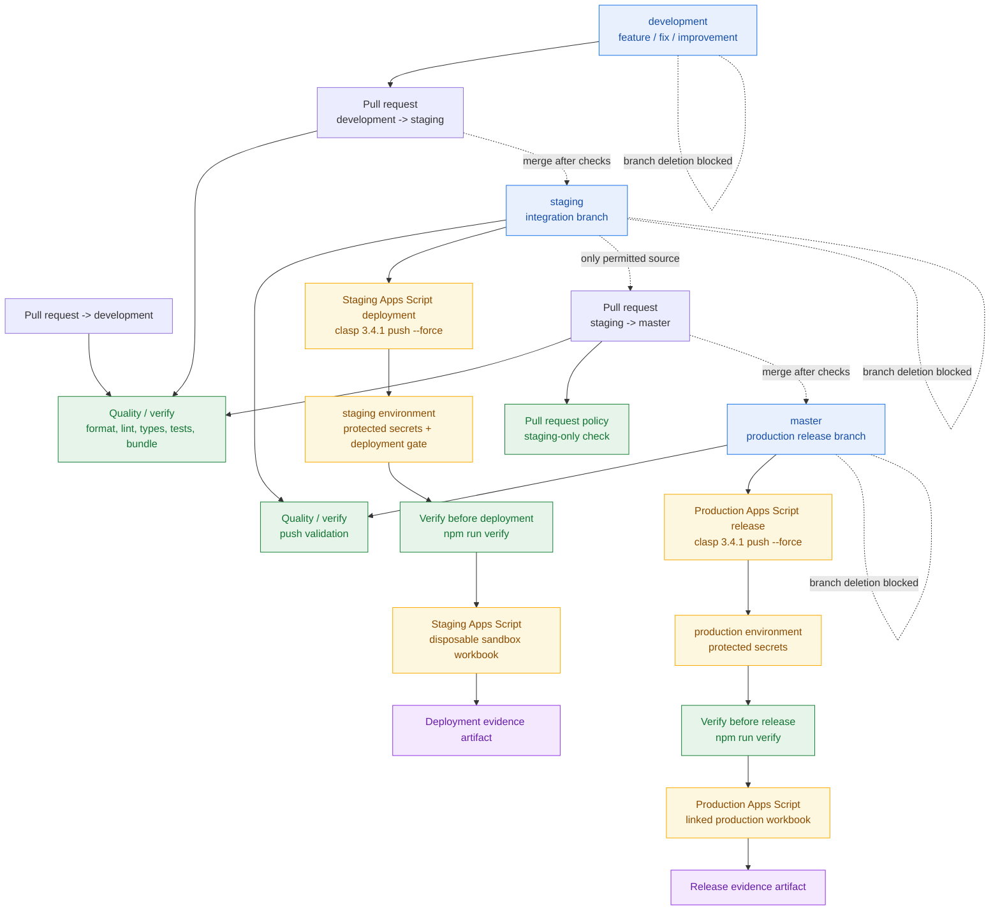

# Investec Budgeter

Investec Budgeter is a Google Sheets-based personal budgeting product with a read-only Investec Private Bank integration. It refreshes accounts, balances, and transactions into an auditable ledger while preserving the owner's budgeting decisions.

The current implementation is Phase 2: a reliable, idempotent ingestion boundary for one Google account and one workbook. The long-term goal is an extensible open-source budgeting product that turns bank activity into useful, explainable budget insight while keeping financial data under the user's control.

## What it does today

- Maintains a normalized `Transactions` ledger in Google Sheets.
- Uses Investec's read-only OAuth client-credentials flow.
- Discovers accounts and refreshes balances.
- Imports posted and pending transactions over an overlapping date window.
- Uses deterministic, versioned identities so repeated syncs do not duplicate rows.
- Preserves user-owned fields such as category, budget item, review status, notes, and exclusion.
- Records sync runs, checkpoints, safe error codes, and freshness information.
- Supports manual refresh and bounded, opt-in live polling for up to four hours.
- Builds from TypeScript and deploys an Apps Script bundle with `clasp`.

Phase 2 deliberately does not categorise transactions, reconcile them to budget items, calculate Safe to Spend, or enable transfers and payments. The ledger is the foundation for those later capabilities.

## Use cases

### Personal budgeting

Use the workbook as the budgeting interface: plan income and spending, maintain goals, review transactions, and retain notes alongside bank activity.

### Safe bank refresh

Run a connection test, refresh accounts and balances, then import a configurable history window. Credentials are stored in Apps Script properties rather than cells.

### Repeatable recovery

If a run is interrupted or a provider request fails, rerun the same operation. The overlap window, checkpoints, locking, payload hashes, and deterministic identities make replay the normal recovery path.

### Extensible open-source foundation

Provider mapping, application orchestration, workbook repositories, and Apps Script adapters are separated so contributors can add fields, rules, providers, or a future backend without silently changing historical transaction meaning.

## Architecture

```text
Google Sheets menu
        |
Apps Script entrypoints
        |
Application sync use cases
        |
Investec client -> OAuth/token cache -> Investec API
        |
DTO validation -> normalization -> versioned identity
        |
Sheets repositories -> Accounts / Transactions / Sync Runs / Current Cycle
```

The primary runtime is a container-bound Google Apps Script project authored in TypeScript and bundled into Apps Script-compatible JavaScript. This keeps the first product close to the workbook while leaving a clear migration path to a durable service when multi-user access, volume, unattended operation, or Apps Script quotas require it.

See [Architecture and Extensibility](docs/architecture-and-extensibility.md) and the [runtime boundary ADR](docs/decisions/ADR-001-runtime-boundary.md).

## Repository layout

```text
src/       TypeScript production code
  entrypoints/  Apps Script globals and menu wiring
  application/  sync and setup use cases
  investec/     authentication, HTTP, DTOs, validation, normalization
  sheets/       workbook schema and repositories
  platform/     Apps Script service adapters
tests/     Vitest unit and repository tests
scripts/   build and bundle validation tools
docs/      setup, operations, contracts, decisions, and acceptance evidence
.github/   quality, deployment, and pull-request policy workflows
```

## Local development

Requirements: Node.js 20+, npm 10+, a Google account with access to the linked Sheets and Apps Script projects, and `clasp` for deployment work.

```bash
npm ci
npm run verify
```

Useful commands:

```bash
npm test             # Vitest suite
npm run typecheck    # strict TypeScript checks
npm run lint         # ESLint
npm run format:check # Prettier verification
npm run build:check  # Apps Script bundle and handler validation
npm run verify       # all pull-request checks
```

For local Apps Script work, copy `.clasp.json.example` to `.clasp.json`, use the intended script ID, and keep credentials outside the repository. The generated `dist/` directory and `.clasp.json` are ignored. Never commit `.env`, credentials, bank data, tokens, or raw provider payloads.

## Workbook setup

After deploying the bundle to a bound spreadsheet:

1. Run `Set up / migrate workbook`.
2. Configure Investec sandbox credentials through the credential modal.
3. Run `Test connection`.
4. Run `Refresh accounts` and select the account(s) to use.
5. Run `Refresh balances` and confirm the account currency.
6. Set the initial import date and cycle settings in `Settings` if needed.
7. Run `Sync transactions`.
8. Optionally start bounded live sync when current-cycle freshness matters.

Live sync is best effort, not a hard real-time guarantee. See [Setup and Live Sync](docs/setup.md) and [Operations](docs/operations.md).

## Environments and release flow

| Branch        | Purpose                                                              | Deployment                                        |
| ------------- | -------------------------------------------------------------------- | ------------------------------------------------- |
| `development` | Feature, bug-fix, improvement, and contributor playground            | Quality checks only                               |
| `staging`     | Integration testing against the disposable Investec sandbox workbook | Protected Apps Script staging deployment          |
| `master`      | Production release branch                                            | Automatic production release after required gates |

```text
development -> staging -> master -> production Apps Script project
```

Direct pushes to `staging` and `master` are blocked. Only `staging` may target `master`. GitHub Actions runs the quality suite on pull requests and on the three long-lived branches. Staging uses `STAGING_SCRIPT_ID` and `CLASPRC_JSON`; production uses `PRODUCTION_SCRIPT_ID` and the protected production environment. Investec credentials are configured in the workbook and are not passed through CI.

Read [Merge Protocol](docs/merge-protocol.md) and [Deployment and Release Operations](docs/deployment.md) before promoting or approving a production pilot. Production remains a separately reviewed read-only rollout, even though the release workflow deploys automatically after a permitted `staging` → `master` merge.

### GitHub Actions and release flow



The flow has three distinct protections: branch rules prevent deletion and direct unsafe updates;
pull-request policy permits only the repository's `staging` branch to promote into `master`; and
the quality/deployment jobs validate the bundle before either Apps Script project is changed. The
staging and production jobs use separate script IDs, while the Investec credentials remain inside
their respective workbooks.

### GitHub Actions and release flow


The flow has three distinct protections: branch rules prevent deletion and direct unsafe updates;
pull-request policy permits only the repository's `staging` branch to promote into `master`; and
the quality/deployment jobs validate the bundle before either Apps Script project is changed. The
staging and production jobs use separate script IDs, while the Investec credentials remain inside
their respective workbooks.

## Security and data boundaries

- Investec access is read-only: accounts, balances, and transactions only.
- No payment, transfer, beneficiary, or write capability is implemented.
- Credentials live in Apps Script properties; access tokens are cached with expiry handling.
- Logs and `Sync Runs` contain counts, identifiers, and safe error information—not tokens or raw provider payloads.
- Provider, system, and user-owned columns are explicitly separated.
- Account numbers and internal identifiers are minimized or masked where persisted.
- Production is disabled in code until sandbox replay and the read-only pilot gate pass.

See [Investec Contract](docs/investec-contract.md) and the [Data Dictionary](docs/data-dictionary.md).

## Roadmap to the ultimate goal

The roadmap is staged so ingestion correctness comes before automation that could misclassify or hide financial activity.

### Phase 2 — Reliable ingestion (current)

Complete the sandbox-backed ledger, idempotent sync, account and balance refresh, bounded live sync, operational evidence, and a safe read-only production pilot.

### Phase 3 — Explainable reconciliation

Add transaction categorisation, merchant cleanup, rules, recurring-obligation matching, review queues, and explicit links from transactions to budget items. User corrections remain authoritative and auditable.

### Phase 4 — Budget intelligence

Project the ledger into budget views, calculate current-cycle movement and Safe to Spend, improve forecasting, and add useful alerts without pretending provider posting is instantaneous.

### Phase 5 — Durable product platform

Move authentication and orchestration behind a backend with managed secrets, durable jobs, observability, migrations, and multi-user authorization when the single-owner Apps Script boundary is no longer sufficient. Keep the Sheets projection and identity/version contracts stable during migration.

### Open-source maturity

Document contribution boundaries, add sanitized provider fixtures and end-to-end sandbox tests, provide reproducible development environments, establish compatibility and migration policy, and make integrations provider-adaptable without requiring contributors to access private financial data.

## Documentation map

- [Phase 2 Implementation Plan](docs/Investec-Budgeter-Phase-2-Implementation-Plan.md) — scope, design decisions, epics, acceptance criteria, and migration triggers.
- [Setup and Live Sync](docs/setup.md) — first-time workbook configuration and live polling.
- [Deployment and Release Operations](docs/deployment.md) — branch flow, CI environments, deployment secrets, production pilot, rollback, and evidence.
- [Merge Protocol](docs/merge-protocol.md) — required branch order, promotion sources, PR rules, and recovery procedure.
- [Operations](docs/operations.md) — refresh, replay, failures, schema recovery, and credential rotation.
- [Architecture and Extensibility](docs/architecture-and-extensibility.md) — safe extension rules for fields, identity, sync modes, and future runtimes.
- [Data Dictionary](docs/data-dictionary.md) — workbook columns and ownership semantics.
- [Investec Contract](docs/investec-contract.md) — checked-in API contract and security boundary.
- [Acceptance Report](docs/acceptance-report.md) — sandbox acceptance evidence and outstanding verification items.
- [Architecture decisions](docs/decisions/) — durable decisions and trade-offs.

## Contributing

Start from `development`, keep changes focused, add tests for behavior changes, update the relevant documentation and fixtures, and run `npm run verify` before opening a pull request. Never include credentials, account identifiers, bank exports, or unsanitized provider payloads in issues, tests, fixtures, logs, or pull requests.

Until the production pilot is accepted, changes affecting identity, schema ownership, credentials, provider contracts, or deployment controls require careful review and an accompanying ADR or migration note.

## Current status

Phase 2 code, workbook templates, Apps Script projects, and the GitHub branch/deployment structure are in place. Local quality checks pass. Sandbox deployment remains the operational proving ground; the acceptance report and read-only production pilot are the gates before the product can claim production readiness.
